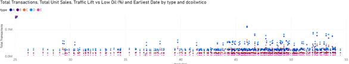
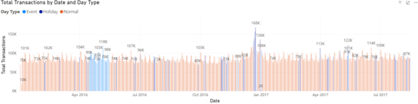

# 🛒 Corporación Favorita: Retail Sales Analysis & Forecasting


> **Dự án phân tích dữ liệu toàn diện (End-to-End Data Analysis):** Từ xử lý 245 triệu bản ghi dữ liệu bán lẻ, trực quan hóa Insight bằng Power BI đến xây dựng mô hình dự báo doanh số bằng XGBoost & LSTM.

---

## 📂 Tài nguyên dự án (Project Resources)

Do giới hạn dung lượng của GitHub, bộ dữ liệu gốc và file báo cáo Power BI đầy đủ (.pbix) được lưu trữ tại Google Drive.

👉 **[Tải xuống Dataset & File Power BI tại đây](https://drive.google.com/drive/folders/1RUezon5yoqu87Aeps91XgLUh2RQHtgl5?usp=sharing)**

---

## 📊 Business Dashboard (Power BI)

Tôi đã xây dựng Dashboard tương tác để theo dõi các chỉ số KPI quan trọng như Tổng doanh số (Unit Sales), Lưu lượng khách (Transactions) và Hiệu suất vận hành.


**Key Metrics:**
* **Total Unit Sales:** 245M
* **Total Transactions:** 51M
* **Best Traffic Day:** Thứ 7 (Saturday)
* **Traffic Efficiency:** 4.80 sản phẩm/khách hàng.

---

## 🔍 Phân tích Insight (Exploratory Data Analysis)

### 1. Phân tích xu hướng theo thời gian (Time-Series & Event Impact)
Biểu đồ dưới đây thể hiện lượng giao dịch theo ngày, phân loại theo ngày thường (Normal), ngày lễ (Holiday) và sự kiện (Event).



**Insight:**
* **Hiệu ứng "Bù Shopping":** Có sự gia tăng đột biến về lượng giao dịch ngay trước và sau các kỳ nghỉ lễ lớn (Giáng sinh, Năm mới), trong khi chính ngày lễ thì giao dịch giảm sâu.
* **Sự kiện đặc biệt:** Các đỉnh nhọn (Spikes) trên biểu đồ tương ứng với các sự kiện địa phương hoặc quốc gia, cho thấy hành vi tiêu dùng nhạy cảm với sự kiện.

### 2. Tác động của Giá Dầu (Oil Price Impact)
Ecuador là quốc gia xuất khẩu dầu mỏ, do đó giá dầu ảnh hưởng lớn đến nền kinh tế và sức mua.



**Insight:**
* Có mối tương quan nghịch biến giữa giá dầu và lưu lượng khách hàng tại các cửa hàng cao cấp (Type A).
* Khi giá dầu giảm, sức mua tại các siêu thị lớn có xu hướng tăng lên, đặc biệt là nhóm hàng nhu yếu phẩm.

---

## 🤖 Mô hình Dự báo (Forecasting Model)

Tôi đã thử nghiệm 4 mô hình khác nhau để dự báo doanh số bán hàng (Unit Sales).

| Model | RMSE | R² Score | Đánh giá |
| :--- | :--- | :--- | :--- |
| **XGBoost** | **0.592** | **0.540** | **Tốt nhất (Selected)** |
| MLP (Deep Learning) | 0.608 | 0.514 | Khá |
| LSTM (RNN) | 0.610 | 0.512 | Khá |
| Linear Regression | 0.659 | 0.430 | Baseline |

**Kết luận:** XGBoost cho kết quả tốt nhất trên dữ liệu dạng bảng (Tabular data) với khả năng xử lý các đặc trưng nhiễu và missing value tốt hơn các mô hình Deep Learning trong ngữ cảnh này.

---

## 🛠️ Công nghệ sử dụng (Tech Stack)

* **Ngôn ngữ:** Python (Pandas, NumPy, Scikit-learn, PyTorch).
* **Trực quan hóa:** Power BI, Matplotlib, Seaborn.
* **Mô hình hóa:** XGBoost, LSTM (Neural Network).
* **Môi trường:** Google Colab / Jupyter Notebook.

---

## 🚀 Clone repo:
    ```bash
    git clone https://github.com/ngduy-dev/Retail-Sales-Performance-Analysis.git
    ```
